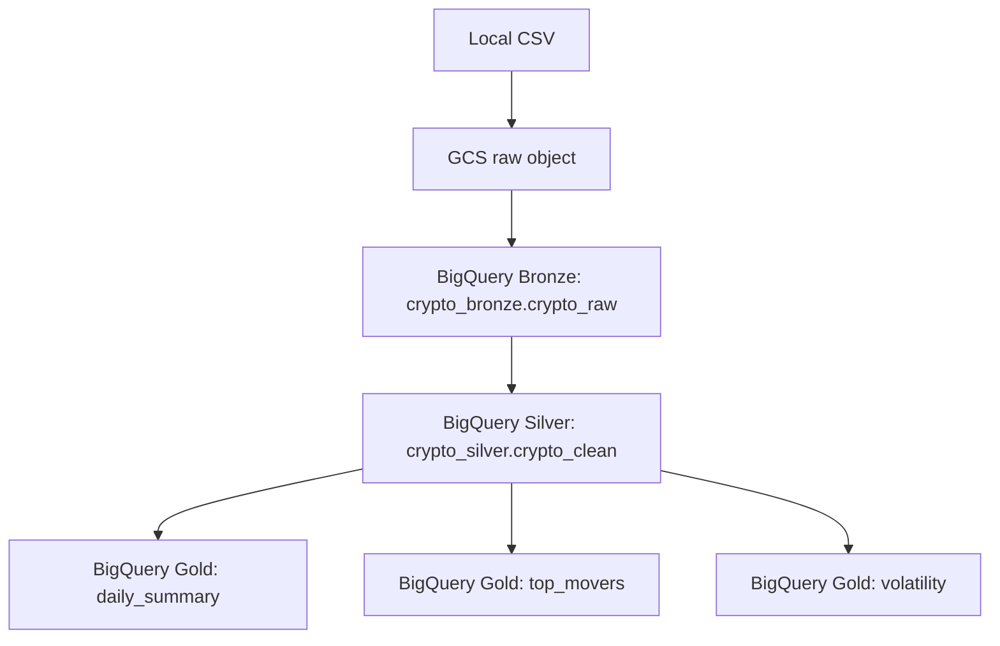

# Medallion Architecture Overview

## 1. Purpose

This document explains the target Medallion architecture for the project and how data moves across **Bronze → Silver → Gold** using **Google Cloud Storage (GCS)** and **BigQuery**.

The goal of the architecture is to keep raw data separate from cleaned data and business-ready outputs, so the pipeline is easier to understand, validate, and extend.

---

## 2. High-level architecture

The system follows a layered Medallion pattern:

- **Bronze** stores raw ingested data with minimal transformation.
- **Silver** stores cleaned and standardized data ready for analytical use.
- **Gold** stores curated business-level outputs such as summaries, aggregates, and reporting tables.

### Main platforms used

- **Google Cloud Storage (GCS)**: landing zone for source files such as CSV uploads.
- **BigQuery**: analytical warehouse that stores Bronze, Silver, and Gold datasets.

---

## 3. Layer descriptions

### Bronze layer

**Purpose**

The Bronze layer preserves source data in its raw form. It acts as the first durable ingestion point and is used for traceability, replay, and troubleshooting.

**What happens here**

- A local CSV file is uploaded to GCS.
- The CSV object from GCS is loaded into a Bronze table in BigQuery.
- Schema can initially be autodetected, with the option to replace it later with an explicit schema.
- Data is not heavily transformed at this stage.

**Why it exists**

- Keeps the original data close to the source.
- Makes it possible to reload downstream layers if logic changes.
- Helps with debugging ingestion issues.

**Example assets**

- GCS object: `crypto/raw/<filename>.csv`
- BigQuery dataset: `crypto_bronze`
- BigQuery table: `crypto_raw`

---

### Silver layer

**Purpose**

The Silver layer contains cleaned, typed, validated, and standardized data. This is the operational analytics layer where raw source inconsistencies are resolved.

**What happens here**

- Column names are standardized.
- Data types are corrected and enforced.
- Null handling and basic quality checks are applied.
- Duplicate rows can be removed if needed.
- Date, numeric, and symbol fields are normalized.

**Why it exists**

- Provides a trusted row-level dataset for analysis.
- Separates data quality logic from final business reporting.
- Reduces repeated cleaning logic in downstream queries.

**Example assets**

- BigQuery dataset: `crypto_silver`
- BigQuery table: `crypto_clean`

---

### Gold layer

**Purpose**

The Gold layer contains business-ready outputs optimized for reporting, dashboarding, and consumption by end users or analytical stakeholders.

**What happens here**

- Silver data is aggregated into final metrics.
- Tables are shaped around clear analytical use cases.
- Outputs may be persisted as tables or generated as reusable views/queries.

**Examples from the provided templates**

- `daily_summary`: per-symbol daily metrics such as average close, min low, max high, total volume.
- `top_movers`: assets with the largest percentage price change over a selected period.
- `volatility`: rolling volatility based on daily log returns.

**Why it exists**

- Gives consumers a stable and simple interface.
- Hides row-level cleaning complexity.
- Improves performance for repeated reporting use cases.

**Example assets**

- BigQuery dataset: `crypto_gold`
- BigQuery tables: `daily_summary`, `top_movers`, `volatility`

---

## 4. Data flow between layers

### End-to-end flow

1. A source CSV exists locally.
2. The file is uploaded to **GCS** using environment variables from `.env`.
3. The file in GCS is loaded into a **Bronze** table in BigQuery.
4. Bronze data is transformed into a cleaned **Silver** table.
5. Silver data is aggregated into **Gold** tables for analytics and reporting.

### Logical flow

- **Local file** → landing input
- **GCS** → raw object storage / ingestion layer
- **BigQuery Bronze** → raw table load
- **BigQuery Silver** → cleaned, standardized table
- **BigQuery Gold** → curated analytics outputs

### Design principle

Each layer should depend only on the layer immediately before it:

- Gold reads from Silver
- Silver reads from Bronze
- Bronze reads from GCS

This keeps the architecture modular and easier to maintain.

---

## 5. Simple diagram

```text
+------------------+
|   Local CSV      |
|   source file    |
+---------+--------+
          |
          | upload
          v
+------------------+
| Google Cloud     |
| Storage (GCS)    |
| raw object       |
+---------+--------+
          |
          | load job
          v
+-----------------------------+
| BigQuery Bronze             |
| dataset: crypto_bronze      |
| table:   crypto_raw         |
+-------------+---------------+
              |
              | clean / standardize
              v
+-----------------------------+
| BigQuery Silver             |
| dataset: crypto_silver      |
| table:   crypto_clean       |
+-------------+---------------+
              |
              | aggregate / model
              v
+----------------------------------------------+
| BigQuery Gold                                |
| dataset: crypto_gold                         |
| tables: daily_summary / top_movers /         |
|         volatility                           |
+----------------------------------------------+
```

A compact markdown version:



---

## 6. Naming conventions

The project should use **lowercase with underscores** for readability and consistency.

### BigQuery datasets

- `crypto_bronze` — raw tables loaded from GCS
- `crypto_silver` — cleaned and standardized tables
- `crypto_gold` — reporting and aggregated tables

### BigQuery tables

Recommended examples:

- Bronze: `crypto_raw`
- Silver: `crypto_clean`
- Gold: `daily_summary`
- Gold: `top_movers`
- Gold: `volatility`

### GCS bucket

Recommended pattern:

- `crypto-medallion-<team-or-project-suffix>`

Example:

- `crypto-medallion-team1`

### GCS object paths

Keep object paths explicit and grouped by purpose.

Recommended pattern:

- `crypto/raw/<filename>.csv`

Possible future extensions:

- `crypto/archive/<filename>.csv`
- `crypto/reference/<filename>.csv`

### Branch naming

Recommended Git branch patterns:

- `main`
- `feature/<short-description>`
- `fix/<short-description>`

Examples:

- `feature/bronze-ingest`
- `feature/silver-cleaning`
- `feature/gold-daily-summary`

---

## 7. Folder structure

A simple project structure should separate ingestion, transformation, SQL, and documentation.

```text
repo-root/
├── .env
├── .env.example
├── bronze/
│   ├── ingest_local_to_gcs.py
│   └── load_gcs_to_bigquery.py
├── silver/
│   └── ... transformation logic or SQL definitions
├── gold/
│   ├── daily_summary.sql
│   ├── top_movers.sql
│   └── volatility.sql
├── docs/
│   ├── architecture.md
│   ├── naming_conventions.md
│   └── gcp_setup_checklist.md
└── README.md
```

### Folder purpose

- **repo-root/.env**: stores environment-specific values such as project ID, bucket name, dataset names, table names, and file paths.
- **bronze/**: ingestion-related scripts for moving data into GCS and loading it into BigQuery.
- **silver/**: logic for cleaning and standardizing Bronze data.
- **gold/**: SQL for final aggregates and analytical outputs.
- **docs/**: architecture and operational documentation.

### Recommended rule

Keep one responsibility per folder:

- ingestion in `bronze/`
- cleaning in `silver/`
- aggregation in `gold/`
- documentation in `docs/`

---

## 8. Orchestration

### How the pipeline is triggered

Based on the current setup, the pipeline can be triggered in two main ways:

#### 1. Manual trigger

This is the simplest starting model.

A user runs the steps manually in sequence:

1. Upload local file to GCS.
2. Load GCS file into Bronze in BigQuery.
3. Run Silver transformation.
4. Run Gold transformation queries.

**When manual is appropriate**

- Early development
- Testing and debugging
- Course or team projects with small-scale data
- Occasional data refreshes

#### 2. Scheduled trigger

This is the recommended operational model once the process stabilizes.

A scheduler can run the pipeline at fixed times, for example:

- daily
- hourly
- weekly

In this model, the orchestration service triggers the ingestion and transformation sequence automatically.

**Typical scheduled flow**

- Scheduler starts pipeline
- Pipeline checks for input file or expected source object
- Bronze load runs
- Silver transformation runs
- Gold tables are refreshed
- Logs and status are recorded

### Recommended orchestration behavior

Regardless of whether the trigger is manual or scheduled, orchestration should enforce the same dependency order:

1. **GCS upload completed**
2. **Bronze load succeeded**
3. **Silver transformation succeeded**
4. **Gold refresh succeeded**

### Minimum orchestration requirements

The orchestrator should be able to answer these questions clearly:

- What started the pipeline?
- Which file was processed?
- Did Bronze complete successfully?
- Did Silver complete successfully?
- Did Gold complete successfully?
- If a step failed, where did it fail?

### Suggested operational model for this project

For clarity and simplicity:

- **Development mode**: manual execution
- **Production or demo mode**: scheduled execution

This gives the team a simple workflow during implementation and a more repeatable workflow later.

---

## 9. Environment variables used by the current flow

The provided ingestion scripts already imply a parameterized setup through `.env`.

Important variables include:

- `GCP_PROJECT_ID`
- `GCS_BUCKET_NAME`
- `GCS_BLOB_NAME`
- `LOCAL_FILE_PATH`
- `BIGQUERY_DATASET_BRONZE`
- `BIGQUERY_TABLE_RAW`

These variables make the architecture easier to move between environments without changing logic.

---

## 10. Architectural summary

This solution uses a clear Medallion architecture on GCP:

- **GCS** is the landing zone for raw source files.
- **Bronze** stores raw ingested data in BigQuery.
- **Silver** stores cleaned and standardized row-level data.
- **Gold** stores final analytical outputs such as summaries, movers, and volatility metrics.

The design is simple, modular, and easy to document:

- each layer has a distinct purpose,
- each downstream layer depends only on the previous layer,
- naming is standardized,
- folder responsibilities are clear,
- orchestration can begin manually and later move to a schedule.

This structure is suitable for a team project because it improves readability, division of responsibilities, and maintainability.
