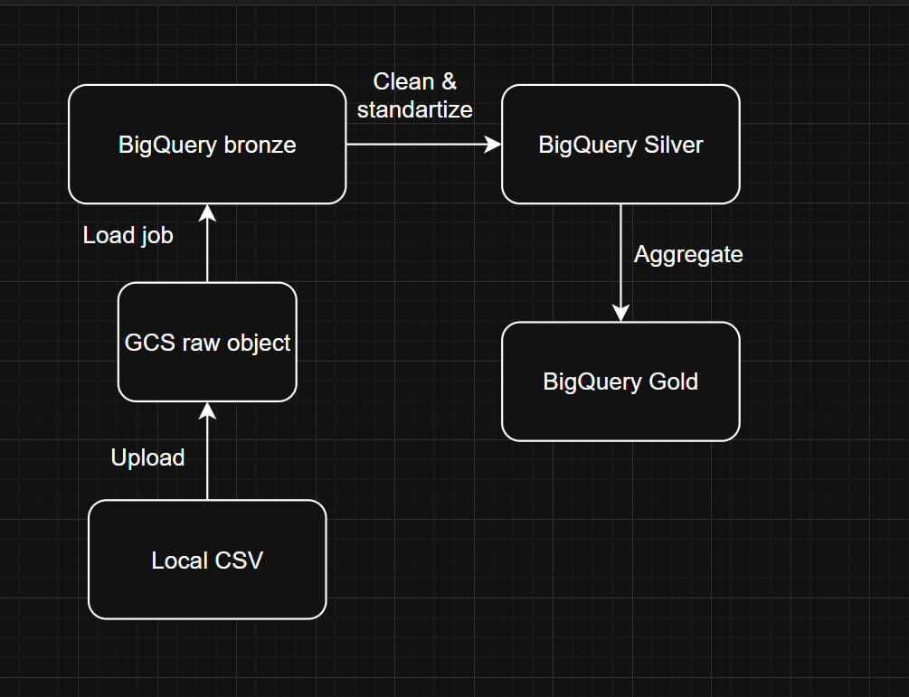

# Medallion Architecture Overview

## 1. High-level architecture

The system follows a layered Medallion pattern:

- **Bronze** stores raw ingested data with minimal transformation.
- **Silver** stores cleaned and standardized data ready for analytical use.
- **Gold** stores curated business-level outputs such as summaries, aggregates, and reporting tables.

### Main platforms used

- **Google Cloud Storage (GCS)**: landing zone for source files such as CSV uploads.
- **BigQuery**: analytical warehouse that stores Bronze, Silver, and Gold datasets.

---

## 2. Layer descriptions

### Bronze layer

The Bronze layer preserves source data in its raw form. It acts as the first durable ingestion point and is used for traceability, replay, and troubleshooting.

**Project assets**

- GCS object: `crypto/raw/CryptocurrencyData.csv`
- BigQuery dataset: `crypto_bronze`
- BigQuery table: `crypto_raw`

---

### Silver layer

The Silver layer contains cleaned, typed, validated, and standardized data. This is the operational analytics layer where raw source inconsistencies are resolved.

**Project assets**

- BigQuery dataset: `crypto_silver`
- BigQuery table: `clean_crypto`

---

### Gold layer

The Gold layer contains business-ready outputs optimized for reporting, dashboarding, and consumption by end users or analytical stakeholders.

**Project templates**

- `daily_summary`: per-symbol daily metrics such as average close, min low, max high, total volume.
- `top_movers`: assets with the largest percentage price change over a selected period.
- `volatility`: rolling volatility based on daily log returns.

**Project assets**

- BigQuery dataset: `crypto_gold`
- BigQuery tables: `daily_summary`, `top_movers`, `volatility`

---

## 4. Data flow between layers

### End-to-end flow

1. A source CSV exists locally.
2. The file is uploaded to **GCS** using environment variables from `.env`.
3. The file in GCS is loaded into a **Bronze** table in BigQuery.
4. Bronze data is transformed into a cleaned **Silver** table.
5. Silver data is aggregated into **Gold** tables for analytics and reporting.

### Logical flow

- **Local file** → landing input
- **GCS** → raw object storage / ingestion layer
- **BigQuery Bronze** → raw table load
- **BigQuery Silver** → cleaned, standardized table
- **BigQuery Gold** → curated analytics outputs

---

## 5. Simple diagram



---

## 6. Folder structure

A simple project structure should separate ingestion, transformation, SQL, and documentation.

```text
repo-root/
├── .env
├── .env.example
├── bronze/
│   ├── cloud_function
│   │   └──main.py
│   ├── ingest_local_to_gcs.py
│   └── load_gcs_to_bigquery.py
├── silver/
│   └── clean_crypto_data.sql
├── gold/
│   ├── daily_summary.sql
│   ├── top_movers.sql
│   └── volatility.sql
├── docs/
│   ├── architecture.md
│   ├── naming_conventions.md
│   └── gcp_setup_checklist.md
└── README.md
```

---

## 7. Automation and orchestration

The pipeline is fully automated and moves data through all Medallion layers in the following order:

**GCS → Bronze → Silver → Gold**

### How it works

- When a new CSV file is uploaded to **Google Cloud Storage (GCS)**, the pipeline starts automatically.
- The file is first loaded into the **Bronze** layer in BigQuery as raw data.
- After that, the **Silver** layer runs automatically to clean and standardize the data.
- Finally, the **Gold** layer runs automatically to create analytical tables for graphs,reporting and insights.

### Execution logic

Each step depends on the previous one:

1. File uploaded to GCS
2. Bronze load runs
3. Silver transformation runs
4. Gold tables are created or refreshed

If one step fails, the next one does not continue.

### Monitoring

The pipeline can be monitored through:

- **Cloud Function logs**
- **BigQuery job history**
- **GCS file events**

This makes it possible to quickly check:

- what triggered the pipeline
- which file was processed
- whether each layer completed successfully

## 8. Environment variables used by the current flow

The provided ingestion scripts already imply a parameterized setup through `.env`.

Important variables include:

- `GCP_PROJECT_ID`
- `GCS_BUCKET_NAME`
- `GCS_BLOB_NAME`
- `LOCAL_FILE_PATH`
- `BIGQUERY_DATASET_BRONZE`
- `BIGQUERY_TABLE_RAW`

These variables make the architecture easier to move between environments without changing logic.

---
